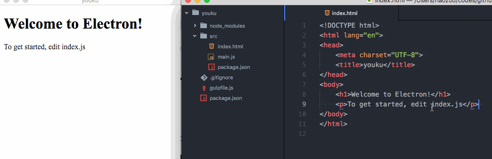

# generator-electron-naive
==================

[![NPM version][npm-image]][npm-url]
![][david-url]
![][dt-url]
![][license-url]

Create desktop app for a website in one minute

## Prerequisites ##

1. Install [yeoman](http://yeoman.io/): `npm install -g yo`
2. Install __this__: `npm install -g generator-electron-naive`

> prepend with `sudo` if you are running on `*nix` OS.

## Use `generator-electron-naive` ##

`yo electron-naive`

> Answer questions as following demonstrated

## debug app ##

Once your project is created by this `generator`, go into the project folder

Run `npm run dev` to launch app in dev mode.

And `livereload` is enabled by default, so you can easily view your updates as following:

## generate app ##

Once your project is created by this `generator`, go into the project folder

Run `npm run dist` to generate the executable file.

> The file will be generated into `dist` folder

## References ##

1. [yeoman](http://yeoman.io/)
2. [gulp](http://gulpjs.com/)
3. [electron](http://electron.atom.io/)

## LICENSE ##

[MIT License](https://raw.githubusercontent.com/leftstick/generator-electron-naive/master/LICENSE)

[npm-url]: https://npmjs.org/package/generator-electron-naive
[npm-image]: https://badge.fury.io/js/generator-electron-naive.png
[david-url]: https://david-dm.org/leftstick/generator-electron-naive.png
[dt-url]:https://img.shields.io/npm/dt/generator-electron-naive.svg
[license-url]:https://img.shields.io/npm/l/generator-electron-naive.svg
